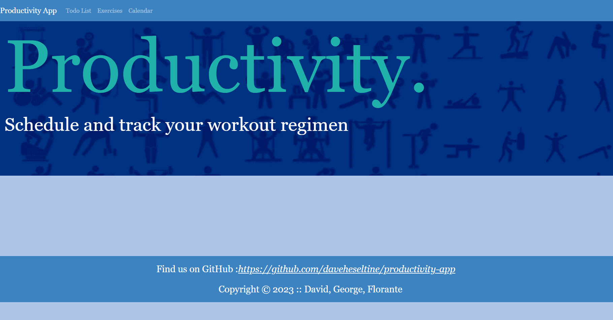
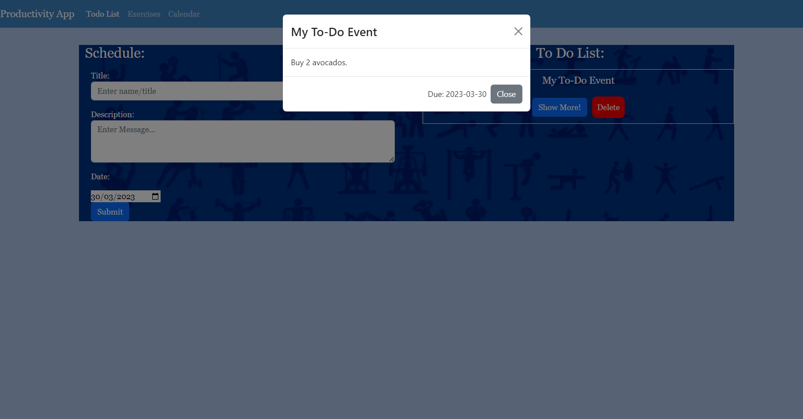
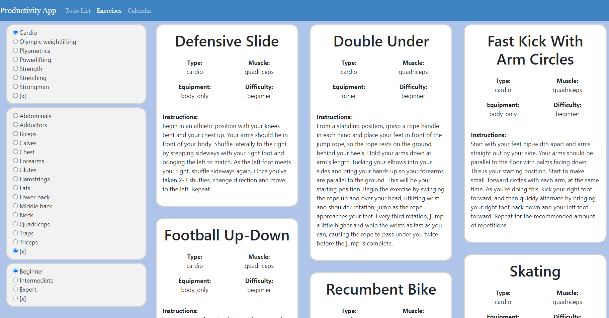
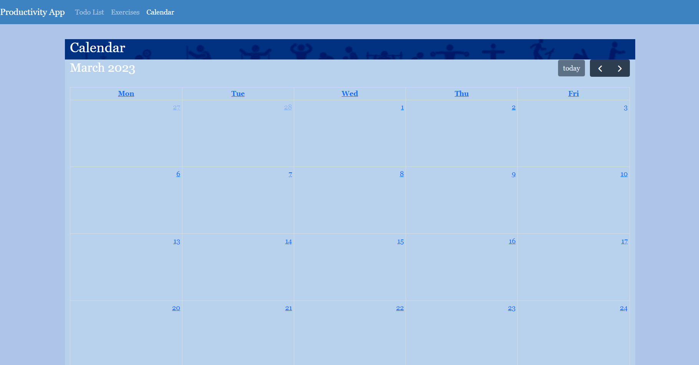

# Productivity App 
 

## Description
As a team, we conceived and executed a design for a client-side single-page application. As we were working collaboratively, we continued to use agile development methodologies and implement feature and bug fixes using git branch workflow and pull requests, using GitHub as a means to track the status of project tasks.<a href="#references">*[1]*</a>

The design we selected for the project was a website designed to help you take control of your health and wellbeing productivity, by providing workout inspiration and tracking/scheduling of your progress. Our motivation for this was to aid users in time management. It also gave us a greater understanding of react and using different libraries in JS.

```
AS A fitness enthusiast
I WANT to access workout ideas
SO THAT I gain may new exercises to increase my productivity
```

```
AS A fitness enthusiast
I WANT to add items to a to-do list
SO THAT I may take record on my current productivity
```

```
AS A fitness enthusiast
I WANT to track to-do list items and thier due dates on a calender
SO THAT I may plan my future productivity
```

</br>

___
## Table of Contents
Design Prompt:
* [Acceptance Criteria](#Acceptance-Criteria)
* [Mock-up](#Mock-up)

Deployment:
* [URL](#URL)
* [Technologies Used](#Technologies-Used)
* [Contributing](#Contributing)
* [Questions/Contacts](#Questions/Contacts)
* [License](#license)

Installation and Use:
- [Productivity App](#productivity-app)
  - [Description](#description)
  - [Table of Contents](#table-of-contents)
- [Design Prompt](#design-prompt)
  - [Acceptance Criteria](#acceptance-criteria)
- [Deployment](#deployment)
  - [URL](#url)
  - [Technologies Used](#technologies-used)
  - [Screenshots of the deployed application:](#screenshots-of-the-deployed-application)
  - [Contributing](#contributing)
  - [Questions/Contacts](#questionscontacts)
  - [License](#license)
- [Installation and Use](#installation-and-use)
  - [Install Git and clone the repository](#install-git-and-clone-the-repository)
  - [Install Visual Studio Code](#install-visual-studio-code)
  - [Install Node.js and dependencies](#install-nodejs-and-dependencies)
  - [Terminal Commands](#terminal-commands)
- [References](#references)

</br>

___
# Design Prompt
## Acceptance Criteria
Your project must fulfil the following requirements<a href="#references">*[2]*</a>:
  You and your group will use everything you’ve learned to create a real-world client-side single-page application that you’ll be able to showcase to potential employers. The user story and acceptance criteria will depend on the project that you create, but your project must fulfill the following requirements:
  * Must use ReactJS.
  * Must use Node.
  * Must deploy this application using Netlify.
  * Must utilize at least two libraries, packages, or technologies that we haven't discussed.
  * Must have a polished front end/UI.
  * Must meet good quality coding standards (indentation, scoping, naming).
  * Have a quality README (with unique name, description, technologies used, screenshot, and link to deployed application).

</br>

___
# Deployment
## URL
* The URL of the GitHub repository: https://github.com/daveheseltine/productivity-app
* The URL of the deployed application: https://mellow-clafoutis-de2706.netlify.app/

</br>

## Technologies Used
The following technologies were used in the project:
* anime.js (https://animejs.com/)
* API Ninjas: Exercises API (https://api-ninjas.com/api/exercises)
* Bootstrap (https://getbootstrap.com/)
* React (https://react.dev/)
* react FullCalendar library (https://www.npmjs.com/package/@fullcalendar/react)
* react-masonry-css (https://www.npmjs.com/package/react-masonry-css)
* react-spinners (https://www.npmjs.com/package/react-spinners)

</br>

## Screenshots of the deployed application:
<a href="#references">*[4]*</a>

</br>

<a href="#references">*[4]*</a>

</br>

<a href="#references">*[4]*</a>

</br>

<a href="#references">*[4]*</a>

</br>

## Contributing
Please contact us if you would like to contribute to the project!

Examples of behavior that contributes to a positive environment for our
community include:<a href="#references">*[3]*</a>
  * Demonstrating empathy and kindness toward other people.
  * Being respectful of differing opinions, viewpoints, and experiences
  * Giving and gracefully accepting constructive feedback.
  * Accepting responsibility and apologizing to those affected by our mistakes,
    and learning from the experience.
  * Focusing on what is best not just for us as individuals, but for the overall
    community.

  Examples of unacceptable behavior include:
  * The use of sexualized language or imagery, and sexual attention or advances of
    any kind.
  * Trolling, insulting or derogatory comments, and personal or political attacks
  * Public or private harassment.
  * Publishing others' private information, such as a physical or email address,
    without their explicit permission.
  * Other conduct which could reasonably be considered inappropriate in a
    professional setting.

## Questions/Contacts
Heseltine, David
GitHub: daveheseltine

Ryder, George
GitHub: NotGeorgeHere

Singcak, Florante
GitHub: FlorSing

## License
MIT License

Copyright (c) 2023 David Heseltine (daveheseltine), George Ryder (NotGeorgeHere) and Florante Singcak (FlorSing)

Permission is hereby granted, free of charge, to any person obtaining a copy
of this software and associated documentation files (the "Software"), to deal
in the Software without restriction, including without limitation the rights
to use, copy, modify, merge, publish, distribute, sublicense, and/or sell
copies of the Software, and to permit persons to whom the Software is
furnished to do so, subject to the following conditions:

The above copyright notice and this permission notice shall be included in all
copies or substantial portions of the Software.

THE SOFTWARE IS PROVIDED "AS IS", WITHOUT WARRANTY OF ANY KIND, EXPRESS OR
IMPLIED, INCLUDING BUT NOT LIMITED TO THE WARRANTIES OF MERCHANTABILITY,
FITNESS FOR A PARTICULAR PURPOSE AND NONINFRINGEMENT. IN NO EVENT SHALL THE
AUTHORS OR COPYRIGHT HOLDERS BE LIABLE FOR ANY CLAIM, DAMAGES OR OTHER
LIABILITY, WHETHER IN AN ACTION OF CONTRACT, TORT OR OTHERWISE, ARISING FROM,
OUT OF OR IN CONNECTION WITH THE SOFTWARE OR THE USE OR OTHER DEALINGS IN THE
SOFTWARE.

</br>

___
# Installation and Use
## Install Git and clone the repository
* In your browser open https://git-scm.com/ and download the intaller.
* Run the `.exe` file and follow the instructions in the installer.
* In file-explorer navigate to your desired directory and run Git Bash by right-clicking and selecting the Git Bash Here option from the context menu.
* Type into Git Bash `git clone git@github.com:daveheseltine/productivity-app.git` and press enter.

## Install Visual Studio Code
* In your browser open https://code.visualstudio.com/ and download the intaller.
* Run the `.exe` file and follow the instructions in the installer.

## Install Node.js and dependencies
* In your browser open https://nodejs.org/en/ and download the intaller.
* Run the `.msi` file and follow the instructions in the installer.
* Open the cloned repository with Visual Studio Code.
* Open the Integrated Terminal by right-clicking in the explorer area and select the Open in Integrated Terminal option from the context menu.
* Type into the Integrated Terminal `npm i` to install the module dependencies, which will be installed at `./node_modules`.

## Terminal Commands
  * `npm start` (*Node.js*) - Run the application.

</br>

___
# References
1. Trilogy Skills Bootcamp (2023) *UK-VIRT-FE-PT-12-2022-U-LOLC/13-project-2-part-1-module/readme.md*
2. Trilogy Skills Bootcamp (2023) *UK-VIRT-FE-PT-12-2022-U-LOLC/13-project-2-part-1-module/01-project-day-1-lesson/README.md*
3. Contributor Covenant: https://www.contributor-covenant.org/
